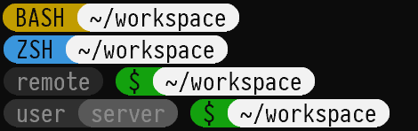

# bubbleprompt

Generator for "bubbly" shell prompts:



Works with Bash and Zsh. Requires a font with Powerline glyphs.

## Usage

Build and install the binary with Cargo:

```
$ cargo install --path .
```

Call the binary from your profile:

```bash
# For Zsh
PROMPT=$(bubbleprompt --shell zsh '{0,6:ZSH {0,15:%~}} ')

# For Bash
PS1=$(bubbleprompt --shell bash '{0,3:BASH {0,15:\w}} ')
```

## Template string

Colored sections are specified with this syntax:

```
{fg,bg:text}
```

The sections can be nested. Supports 256 colors.
